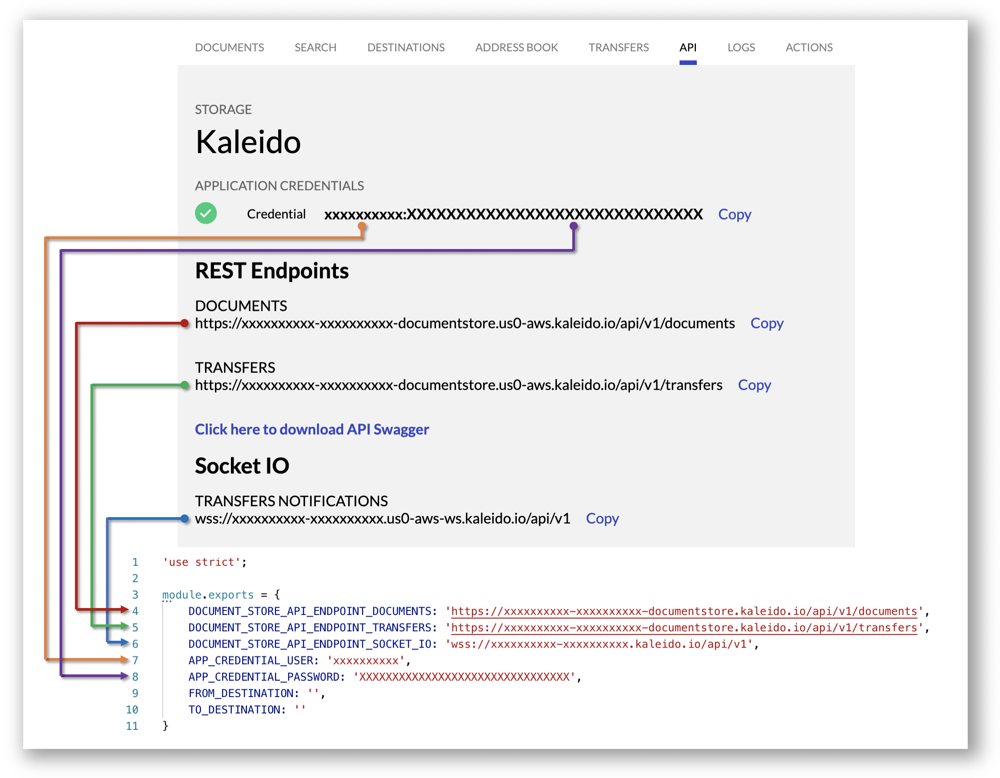
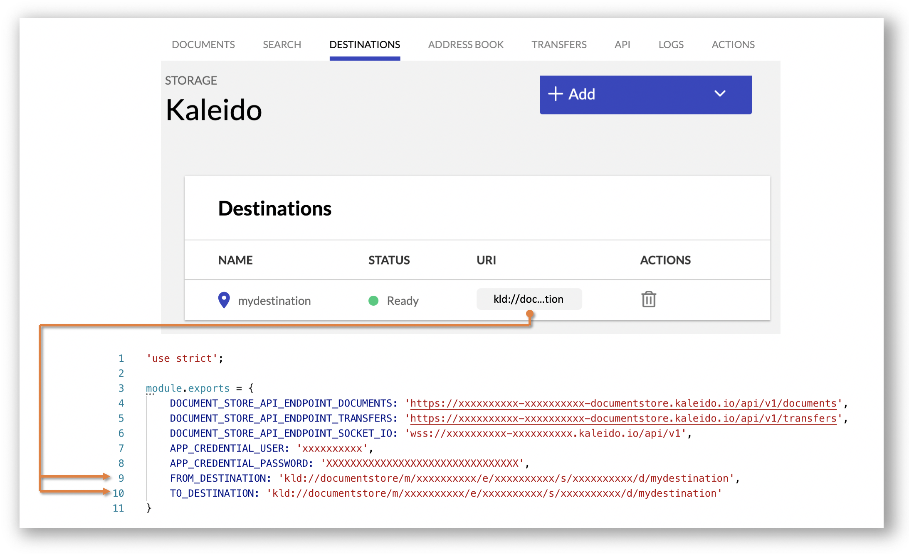

# Document Store Snippets

## Introduction
This repository contains a set of code snippets written in **NodeJS** illustrating how to programmatically interact with the Kaleido Document Store service. The snippets include:

- [Upload](#upload)
- [Download](#download)
- [Browse](#browse)
- [Search](#search)
- [Inspect](#inspect)
- [Transfer](#transfer)
- [Transfer logs](#transfer-logs)
- [Transfer events](#transfer-events)
- [Delete](#delete)

When a document is added to storage through the [upload](#upload) API, a hash that uniquely identifies its content is automatically calculated and returned. This value
can be used to pin the document on-chain and is also returned by the [browse](#browse), [search](#search) and [inspect](#inspect) APIs.
  
The complete API specification can be found [here](https://api.kaleido.io/documentstore.html). The API swagger file can be downloaded [here](https://api.kaleido.io/service-documentstore.yaml). For more information about the document store service, visit the [documentation](https://docs.kaleido.io/kaleido-services/document-store/).

## Preferences

By default, on the recipient side, transferred documents are saved to `/received/${recipient_destination}`. This path can be customized using the preferences API. The path must be absolute and can contain any combination of the variables **sender_org**, **sender_destination**, and **recipient_destination**.

- [Get Preferences](#get-preferences)
- [Set Preferences](#set-preferences)

## External Storage

The Document Store service can optionally be configured to use external storage. AWS S3 buckets and Azure Blob containers are supported. Note that documents added to external storage through means other than the [upload](#upload) API will not to have their hashes automatically calculated. The following two code snippets show how to calculate hashes in such scenario:

- [Calculate single hash](#Calculate-single-hash)
- [Calculate all hashes](#Calculate-all-hashes)

## Getting Started

1. Ensure prerequisites are installed: [Git](https://git-scm.com/), [NodeJS](https://nodejs.org/) and [npm](https://www.npmjs.com/).
2. Clone this repository and install dependencies by running `npm install`.
3. Login to the Kaleido console: https://console.kaleido.io/login. If this is your first time using Kaleido you can register for free here: https://console.kaleido.io/login/signup.
4. Create a consortium and an environment with at least one node (any protocol). Detailed information on completing these steps can be found here: https://docs.kaleido.io/using-kaleido/quick-start.
5. On the environment screen, click on the **Add** button and select **Add Services**. Select **Document Store** and click on **Add**.
6. Look for the **Document Store** entry under **Member Services** and click on it when the status icon turns green.
7. Click on the **API** menu and then on the **Generate New** button under **Application Credentials**. Copy the **Credentials**, **Rest Endpoints** and **Socket IO** values into [./lib/common.js](./lib/common.js) as follows:



> Note: the remaining two steps are only required for document transfers

8. On the Document Store screen, click on the **Destinations** menu and then on the **Setup Destination** button. On the next screen click on **Let Kaleido Register my Org On-Chain**. Type `mydestination` on the destination name input field and click **Finish**.
9. Copy the **destination URI** into [./lib/common.js](./lib/common.js) as follows:



>  In a practical application destinations would correspond to document store service instances belonging to different organizations. In this example we are using a single service instance and a single destination just for illustration/test purposes.

# Snippets

## Upload

### Sample code

```Javascript
'use strict';

const FormData = require('form-data');
const fs = require('fs');
const axios = require('axios');
const common = require('./common');

const formData = new FormData();
formData.append('document', fs.createReadStream(__dirname + '/../resources/kaleido.png'));

axios({
    method: 'put',
    url: common.DOCUMENT_STORE_API_ENDPOINT_DOCUMENTS + '/images/kaleido-logo.png',
    data: formData,
    headers: formData.getHeaders(),
    auth: {
      username: common.APP_CREDENTIAL_USER,
      password: common.APP_CREDENTIAL_PASSWORD
    }
}).then(response => {
    console.log(response.data)
}).catch(err => {
    console.log('Failed to upload document: ' + err);
});
```

### Sample response

```JSON
{ 
  "result": "success",
  "hash": "b5d4c3efcc59b32870af6d3cef645c9d6dbc5580f556316af2aabff768e54d77"
}
```

### Notes
- **PUT** requests will overwrite the document if it already exists in storage. **POST** requests on the other hand will return 409 (conflict).
- The folder **images** will be automatically created if it doesn't already exist.
- The name of the document in the file system and the request can be different.
- The property **hash** in the JSON response will include a value that uniquely identifies the document by content. This value can be used to pin the document on-chain by storing it in a smart contract.

To run the sample code: `npm run upload`

## Download

### Sample code

```Javascript
'use strict';

const fs = require('fs');
const axios = require('axios');
const common = require('./common');

axios({
    url: common.DOCUMENT_STORE_API_ENDPOINT_DOCUMENTS + '/images/kaleido-logo.png',
    auth: {
      username: common.APP_CREDENTIAL_USER,
      password: common.APP_CREDENTIAL_PASSWORD
    },
    responseType: 'stream'
}).then(response => {
  response.data.pipe(fs.createWriteStream(__dirname + '/../resources/kaleido_downloaded.png'));
}).catch(err => {
  console.log('Failed to download document: ' + err);
});
```

To run the sample code: `npm run download`

## Browse

### Sample code

```Javascript
'use strict';

const axios = require('axios');
const common = require('./common');

axios({
    url: common.DOCUMENT_STORE_API_ENDPOINT_DOCUMENTS + '/images',
    auth: {
      username: common.APP_CREDENTIAL_USER,
      password: common.APP_CREDENTIAL_PASSWORD
    }
}).then(response => {
  console.log(response.data);
}).catch(err => {
  console.log('Failed to browse documents: ' + err);
});
```

### Sample response
```JSON
{
  "is_truncated": false,
  "entries":
   [
     { 
       "name": "kaleido-logo.png",
       "is_directory": false,
       "size": 141733,
       "last_modified": "2019-11-03T13:56:59.529Z",
       "hash": "b5d4c3efcc59b32870af6d3cef645c9d6dbc5580f556316af2aabff768e54d77"
      }
   ]
}
```

### Notes
- The response will include all the entries (documents and directories) that reside in the directory specified in the request URL path.
- The boolean property **is_directory** in the JSON response indicates whether an entry is a file or a directory. 
- Results are paginated with a default limit of 100. Use query strings **offset** and **limit** to iterate through results.
- The boolean property **is_truncated** in the JSON response indicates if there are more results available.

To run the sample code: `npm run browse`

## Search

### Sample code

```Javascript
'use strict';

const axios = require('axios');
const common = require('./common');

const ENDPOINT = common.DOCUMENT_STORE_API_ENDPOINT_DOCUMENTS.substr(0, common.DOCUMENT_STORE_API_ENDPOINT_DOCUMENTS.length - 9);

axios({
    url: ENDPOINT + '/search?query=kaleido',
    auth: {
      username: common.APP_CREDENTIAL_USER,
      password: common.APP_CREDENTIAL_PASSWORD
    }
}).then(response => {
  console.log(response.data);
}).catch(err => {
  console.log('Failed to search for document: ' + err);
});
```

### Sample response
```JSON
{
  "documents":
   [
     {
       "full_path": "images/kaleido-logo.png",
       "last_modified": "2019-11-03T14:10:59.201Z",
       "hash": "b5d4c3efcc59b32870af6d3cef645c9d6dbc5580f556316af2aabff768e54d77",
       "size": 141733
      }
    ]
}
```

### Notes

- Set the value of the query string **by_hash** to **true** in order to search by hash instead of path/name.
- Search results will contain up to 100 matches.

To run the sample code: `npm run search`

## Inspect

### Sample code

```Javascript
'use strict';

const axios = require('axios');
const common = require('./common');

axios({
    url: common.DOCUMENT_STORE_API_ENDPOINT_DOCUMENTS + '/documents/images/kaleido-logo.png?details_only=true',
    auth: {
      username: common.APP_CREDENTIAL_USER,
      password: common.APP_CREDENTIAL_PASSWORD
    }
}).then(response => {
  console.log(response.data);
}).catch(err => {
  console.log('Failed to browse documents: ' + err);
});
```

### Sample response
```JSON
{ 
  "name": "kaleido-logo.png",
  "is_directory": false,
  "size": 141733,
  "last_modified": "2019-11-03T14:10:59.201Z",
  "hash": "b5d4c3efcc59b32870af6d3cef645c9d6dbc5580f556316af2aabff768e54d77"
}
```

### Notes
- The value of the query string **details_only** in the request must be **true** in order to obtain the resource metadata. Otherwise the resource content will be returned.

To run the sample code: `npm run inspect`

## Transfer

### Sample code

```Javascript
'use strict';

const axios = require('axios');
const common = require('./common');

axios({
    method: 'post',
    url: common.DOCUMENT_STORE_API_ENDPOINT_TRANSFERS,
    auth: {
      username: common.APP_CREDENTIAL_USER,
      password: common.APP_CREDENTIAL_PASSWORD
    },
    data: {
      from: common.FROM_DESTINATION,
      to: common.TO_DESTINATION,
      document: '/images/kaleido-logo.png'
    }
}).then(response => {
  console.log(response.data);
}).catch(err => {
  console.log('Failed to delete document: ' + err);
});
```

### Sample response
```JSON
{
    "result": "Document sent.",
    "transfer_id": "cbcce631-4355-4445-b750-0b90c78c78a1"
}
```

### Notes
- The property `transfer_id` is new. You may need to upgrade your environment to access it.

To run the sample code: `npm run transfer`

## Transfer logs

### Sample code

```Javascript
'use strict';

const axios = require('axios');
const common = require('./common');

axios({
    url: common.DOCUMENT_STORE_API_ENDPOINT_TRANSFERS,
    auth: {
      username: common.APP_CREDENTIAL_USER,
      password: common.APP_CREDENTIAL_PASSWORD
    }
}).then(response => {
  console.log(response.data);
}).catch(err => {
  console.log('Failed to retrieve transfer logs: ' + err);
});
```

### Sample response

```JSON
{
  "transfers":
   [
     {
       "id": "cbcce631-4355-4445-b750-0b90c78c78a1",
       "timestamp": "2019-11-03T14:57:02.774Z",
       "from": "kld://documentstore/m/zzuawz6bbl/e/zzjsqi1m1n/s/zzx11m3wmk/d/a",
       "to": "kld://documentstore/m/zzlkw2gkyj/e/zzjsqi1m1n/s/zzued51b4k/d/b",
       "hash": "b5d4c3efcc59b32870af6d3cef645c9d6dbc5580f556316af2aabff768e54d77",
       "document": "/images/kaleido-logo.png",
       "status": "received",
       "transferHash": "a436d9b261b29df52d2f00f853aee726177db2f6f1956fc9a2f8bce76a053277",
       "senderSignature": "Unz2OWjiSRLJmZ/5XVwroYVP+jKASwJeZ7mRqntbpTeMcyMeAexd9XGNOwOWD7PQWRmGbk2MZESMmBqRScebyUaAZDrj+zTxMYePWBM2vN7PA0ta3YKk+5VidOtHyeHxmIes9OKK/IOGj2F4RSAPOZVlkEvSHU8YXoFpn8t1rN6KRCtTgmYzF6lmCewv9PA1KCI6ZUxhcnWcPD01vtGkFDXx0s3IKRJ5oDvEnWf0PxVsSe3k75PTUX4z3j4ktypKfQdFVH7yAfVYNcbhhI9YLK8xajC1meNvbp5WB7Mv5lF0gSgueb7D45Pct1uAgmnk2eSV0wVX9MnoiQUGN18ujA==",
       "recipientSignature": "fsA/5zCYoZCNWvATVBG0YECyvo4VnxHk9/KeCzOm8fyPmC4QbyQ4UwQUpkP7rSEQGqxu5UrZsLTouxVl/fX0T1bzHk851S9lOSop5AEx9ZDxjCZiGSMQ9quIceR0VsITv/gGYa4i1hPYYy8m7W7F6SBuIUkUg5EzRurhyXSZmUFw5O/U9+yqgfWnzxo+DuQ6Im/Hs2XKOq/M8JJe++vwaJCbc/eKAwnSZ1Xt5FFl4ZAtFYw4lwdnEAV3AwkcK8NCo/XueD5/L3agt5u9ykPjMAswHEg3HrSP00QlfM01tx6Cb5tgGBF/GBQgcTFDwVos9Bjl+m2TwZJmHDHVNNZR0Q=="
      }
   ]
}
```

### Notes
- The properties **transferHash**, **senderSignature** and **recipientSignature** are new. You may need to upgrade your environment to access them.
- The recipient can use **senderSignature** as proof of the transfer.
- The property **recipientSignature** will only be present for successful transfers (status received).
- The sender can use **recipientSignature** as proof of the transfer.
- The property transferHash can be calculated as follows: concatenate properties **from**, **to**, **hash** and **timestamp**. Calculate SHA256 hex digest of result.

To run the sample code: `npm run transfer_logs`

## Transfer events

### Sample code

```Javascript
'use strict';

const io = require('socket.io-client');
const common = require('./common');

io.connect(common.DOCUMENT_STORE_API_ENDPOINT_SOCKET_IO,
  {
    extraHeaders: {
      Authorization: 'Basic ' + Buffer.from(common.APP_CREDENTIAL_USER + ':' + common.APP_CREDENTIAL_PASSWORD).toString('base64')
    }
  }).on('connect', () => {
    console.log('Listening to events');
  }).on('connect_error', err => {
    console.log('Connection error' + err);
  }).on('error', err => {
    console.log('Error:' + err);
  }).on('document_sent', data => {
    console.log('Document sent: ' + JSON.stringify(data));
  }).on('document_received', data => {
    console.log('Document received: ' + JSON.stringify(data));
  }).on('transfer_acknowledgement', data => {
    console.log('Transfer acknowledgement: ' + JSON.stringify(data));
  });
```

### Sample event
```JSON
{
  "transferId":"cd7kg63q2a",
  "timestamp":"2019-11-03T14:57:02.774Z",
  "from":"kld://documentstore/m/zzuawz6bbl/e/zzjsqi1m1n/s/zzx11m3wmk/d/a",
  "to":"kld://documentstore/m/zzlkw2gkyj/e/zzjsqi1m1n/s/zzued51b4k/d/b",
  "hash":"b5d4c3efcc59b32870af6d3cef645c9d6dbc5580f556316af2aabff768e54d77",
  "document":"/images/kaleido-logo.png",
  "status":"received",
  "transferHash": "a436d9b261b29df52d2f00f853aee726177db2f6f1956fc9a2f8bce76a053277",
  "senderSignature": "Unz2OWjiSRLJmZ/5XVwroYVP+jKASwJeZ7mRqntbpTeMcyMeAexd9XGNOwOWD7PQWRmGbk2MZESMmBqRScebyUaAZDrj+zTxMYePWBM2vN7PA0ta3YKk+5VidOtHyeHxmIes9OKK/IOGj2F4RSAPOZVlkEvSHU8YXoFpn8t1rN6KRCtTgmYzF6lmCewv9PA1KCI6ZUxhcnWcPD01vtGkFDXx0s3IKRJ5oDvEnWf0PxVsSe3k75PTUX4z3j4ktypKfQdFVH7yAfVYNcbhhI9YLK8xajC1meNvbp5WB7Mv5lF0gSgueb7D45Pct1uAgmnk2eSV0wVX9MnoiQUGN18ujA==",
  "recipientSignature": "fsA/5zCYoZCNWvATVBG0YECyvo4VnxHk9/KeCzOm8fyPmC4QbyQ4UwQUpkP7rSEQGqxu5UrZsLTouxVl/fX0T1bzHk851S9lOSop5AEx9ZDxjCZiGSMQ9quIceR0VsITv/gGYa4i1hPYYy8m7W7F6SBuIUkUg5EzRurhyXSZmUFw5O/U9+yqgfWnzxo+DuQ6Im/Hs2XKOq/M8JJe++vwaJCbc/eKAwnSZ1Xt5FFl4ZAtFYw4lwdnEAV3AwkcK8NCo/XueD5/L3agt5u9ykPjMAswHEg3HrSP00QlfM01tx6Cb5tgGBF/GBQgcTFDwVos9Bjl+m2TwZJmHDHVNNZR0Q=="
}
```

### Notes
 - Properties **transferHash**, **senderSignature** and **recipientSignature** are new. You may need to upgrade your environment to access them.
 - The recipient can use **senderSignature** as proof of the transfer.
 - The property **recipientSignature** will only be present for successful transfers (status received).
 - The sender can use **recipientSignature** as proof of the transfer.
 - The property transferHash can be calculated as follows: concatenate properties **from**, **to**, **hash** and **timestamp**. Calculate SHA256 hex digest of result.
 - The property **status** in the JSON event will have one of the following three values:
   - **sent**: document has been dispatched. It may or may not have been received.
   - **received**: there is confirmation that the document has been received.
   - **failed**: an error occurred that prevented the document from being received.

> Tip: open two terminal windows and run the event snippet in one, and the transfer snippet in the other to see events in action.

To run the sample code: `npm run transfer_events`


## Delete

### Sample code

```Javascript
'use strict';

const axios = require('axios');
const common = require('./common');

axios({
    method: 'delete',
    url: common.DOCUMENT_STORE_API_ENDPOINT_DOCUMENTS + '/images/kaleido-logo.png',
    auth: {
      username: common.APP_CREDENTIAL_USER,
      password: common.APP_CREDENTIAL_PASSWORD
    }
}).catch(err => {
  console.log('Failed to delete document: ' + err);
});
```

To run the sample code: `npm run delete`

## Get Preferences

### Sample code

```Javascript
'use strict';

const axios = require('axios');
const common = require('./common');

const ENDPOINT = common.DOCUMENT_STORE_API_ENDPOINT_DOCUMENTS.substr(0, common.DOCUMENT_STORE_API_ENDPOINT_DOCUMENTS.length - 10);

axios({
    url: ENDPOINT + '/preferences',
    auth: {
      username: common.APP_CREDENTIAL_USER,
      password: common.APP_CREDENTIAL_PASSWORD
    }
}).then(response => {
  console.log(response.data);
}).catch(err => {
  console.log('Failed to delete document: ' + err);
});
```

### Sample response

```JSON
{
  "receivedDocumentsPath": "/received/${recipient_destination}"
}
```

To run the sample code: `npm run preferences_get`

## Set Preferences

### Sample code

```Javascript
'use strict';

const axios = require('axios');
const common = require('./common');

const ENDPOINT = common.DOCUMENT_STORE_API_ENDPOINT_DOCUMENTS.substr(0, common.DOCUMENT_STORE_API_ENDPOINT_DOCUMENTS.length - 10);

axios({
    method: 'put',
    url: ENDPOINT + '/preferences',
    auth: {
      username: common.APP_CREDENTIAL_USER,
      password: common.APP_CREDENTIAL_PASSWORD
    },
    data: {
      key: 'receivedDocumentsPath',
      value: '/transfers/to/${recipient_destination}/from/${sender_org}-${sender_destination}'
    }
}).then(response => {
  console.log(response.data);
}).catch(err => {
  console.log('Failed to delete document: ' + err);
});
```

### Sample response

```JSON
{
  "result": "success"
}
```

To run the sample code: `npm run preferences_set`

## Calculate single hash

> Use only when uploading documents to external storage through means other than the [upload](#upload) API.

### Sample code

```Javascript
'use strict';

const axios = require('axios');
const common = require('./common');

axios({
    method: 'patch',
    url: common.DOCUMENT_STORE_API_ENDPOINT_DOCUMENTS + '/images/kaleido-logo.png',
    auth: {
      username: common.APP_CREDENTIAL_USER,
      password: common.APP_CREDENTIAL_PASSWORD
    }
}).then(response => {
  console.log(response.data);
}).catch(err => {
  console.log('Failed to calculate hash: ' + err);
});
```

### Sample response

```JSON
{ 
  "result": "success",
  "hash": "b5d4c3efcc59b32870af6d3cef645c9d6dbc5580f556316af2aabff768e54d77"
}
```

To run the sample code: `npm run calculate_single_hash`

## Calculate all hashes

> Use only when uploading documents to external storage through means other than the [upload](#upload) API.

### Sample code

```Javascript
'use strict';

const axios = require('axios');
const common = require('./common');

const ENDPOINT = common.DOCUMENT_STORE_API_ENDPOINT_DOCUMENTS.substr(0, common.DOCUMENT_STORE_API_ENDPOINT_DOCUMENTS.length - 10);

axios({
    method: 'post',
    url: ENDPOINT + '/sync_hashes?reset=true',
    auth: {
      username: common.APP_CREDENTIAL_USER,
      password: common.APP_CREDENTIAL_PASSWORD
    }
}).then(response => {
  console.log(response.data);
}).catch(err => {
  console.log('Failed to calculate all hashes: ' + err);
});
```

### Sample response

```JSON
{
    "hashes_calculated": 1
}
```

### Notes

- When the boolean value of the query parameter **reset** is
  - **false**: only missing hashes will be calculated
  - **true**: all hashes will be calculated

> Note: the value of the boolean query parameter **reset** should be **true** only if documents are deleted from external storage through means other than the [delete](#delete) API.

To run the sample code: `npm run calculate_all_hashes`